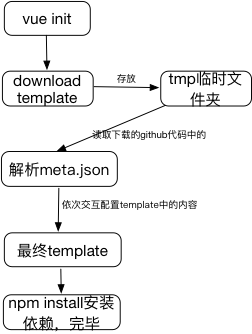

## vue-cli原理
### 教你怎么搭建一个类似vue-cli的炫酷安装工具
#### 原理及准备工作
> 用过vue的同学一定对vue-cli不陌生，vue-cli是vue全家桶的一部分，俗称脚手架。是vue官方给我们提供的一个方便的开发工具。
在使用vue-cli非常简单，只需要使用npm install vue-cli -g安装即可，然后只要运行vue init按照提示依次安装就OK了。

> 这么简单的操作步骤，也是vue艺术所在，让简单易用成为vue的座右铭。此时，你肯定也和我一样，也想让自己的项目能这样安装，那又该怎么做呢？
如果你学过一点儿C语言（很多后端语言都有类似的例子），通常会写过一个题目，这个题目开始让你在命令行中输入几个数字，然后按下enter，程序去执行
最后打印出结果。

> 这种在命令行停下来等待输入，然后将输入的内容作为参数放到程序中去运行，最后给出结果的模式不就是vue-cli在运行vue init时候的流程吗。其实思想是一样的，
只不过这里我们用的是node来完成的。如果用node提供的api来写，可以使用process模块操作。但是，这里使用一个npm成熟的模块——commander。具体该模块的使用方法
可以参见我另一篇博客——"命令行那些事儿"，有详细的介绍。

#### 认识npm的bin

> bin字段一般场景下使用不多，但其实这个字段很有用。bin字段可以帮助我们在执行npm install -g模块的时候添加PATH（PATH在系统中的作用就不赘述了，不了解的可以去百度一下）。注意这种方式是通过npm来注入的，因此必须是
npm包才会有效。vue-cli本身就是通过npm来安装的，这也是bin能发挥作用的原因；

>macOS 默认情况下，npm全局安装的包在路径"/usr/local/bin/lib"下；

> 在package.json中配置了bin字段，可以允许我们在npm包根目录下添加一个bin文件夹。该文件下存储一些命令行要执行的脚本文件；



```
注意：bin下写的脚本要想起作用，需要在代码的最开始添加一行代码：#!/usr/bin/env node
```
> #!/usr/bin/env node 是在告诉计算机当前的代码运行环境是node，如果不写这段代码，那么计算机将不清楚这段代码的执行环境是什么。


#### vue-cli的设计思路
> vue-cli本身随着后期的迭代，具有很多人性化的设计方案，我们这里就不分析其中的源码了，感兴趣的可以去官方的GitHub去看。这里主要介绍一下vue-cli的思路；
其实说起来也很简单，无非就是两步：

1. 和用户进行互动，获取项目设置的必要参数；
2. 从github仓库下载代码到本地；

> vue-cli其实还不单单做了这两件事，操作过vue-cli的同学可以发现，vue-cli提供了例如eslint、karam等可选内容的安装，
也就是说，你可以按照自己的需要去定制脚手架的一些附加功能。这个特点在稍后我们也会进行分析；先来分析以上基本的两点：

#### 如何设计命令行交互？
>上面已经提到了部分内容，其实思路就是在npm安装的时候，首先写一个文件，比如vue-init，这个文件放到bin关键字中，这样就可以在npm安装完毕后将这个文件以命令行的形式注入进去。
然后需要做的就是在这个文件vue-init安装完毕后，就可以执行vue init命令，此时每次执行都会和用户有一个交互操作，这个主要采用process模块的stdin输入流模块，类似C语言的输入流方法。
只不过在node端，需要需要利用stdin的一个data事件去监听用户输入内容，并将获取用户在命令行的输入内容。此时就完成了和用户的互动，并可以拿到用户的输入内容。

> vue-cli没有自己去用node去造轮子，而是在这里使用了两个模块：[commander模块](https://github.com/tj/commander.js)和[inquirer模块](https://github.com/SBoudrias/Inquirer.js)；
其中commander模块完成的就是读取命令行参数，并可以完成一些常用的help设置（类似npm help）。Inquirer模块主要完成的是命令行的交互读取，可以将读取到的命令行参数作为自己的参数返回，在回调函数中去反馈处理；
详细的使用方法可以参见我的另外两篇博客；

#### 如何从github仓库拉取代码？

> vue-cli用一个第三方的github仓库工具[download-git-repo模块](https://github.com/flipxfx/download-git-repo/blob/master/index.js)来拉取github仓库代码。该库可以给定git地址，然后从github上拉取代码；

#### vue-cli如何工作？
> vue-cli的本质就是一个命令行工具，本身并不集成脚手架的任何内容。在vue-cli中，将我们日常所说的脚手架成为template，vue官方有一个webpack的template，当然vue-cli默认也是安装
这个，但是vue-cli也支持可以安装第三方的脚手架。vue-cli为了降低和template的耦合度采用了一个规则来和template结合。那就是meta.json/meta.js文件。这两个文件任意一个都被
vue-cli所支持，vue-cli在download下脚手架代码后，会先读取代码中的meta.json文件，然后去继续接下来对脚手架的定制化配置（比如是否添加eslint、e2e、unit等）。



#### 解读meta.json
> vue-cli的meta.json是vue-cli的一个json格式的描述文件。用来定制使用vue-cli的时候，怎样输出提示用户的内容。例如项目名称、命令行交互时候输出给用户的内容等。


#### 解读模版概念
> 如果你理解vue-cli只是说简单配置一下，然后直接使用git工具clone代码，你就错了。vue-cli作为一款工具，野心不止于此。vue-cli对脚手架进行了模版化，也就是说，一个vue-cli可以支持
多个脚手架来使用。那么如何做到这点呢，这就是vue-cli中以模版的概念来处理的。模版的概念，做过后端渲染静态页面的人应该不会陌生。我们在后端渲染的时候，往往会编写前端模版，
使用模版来动态填充很多内容。vue-cli也是如此，它使用模版语法来对可配置的部分进行替换，在clone代码后，通过模版引擎渲染脚手架代码，这样就可以动态填充其中的配置内容。
也就做到了按照用户的命令行输入内容完成不同功能脚手架的生成。ps：模版内容的解析，可以看一下我的另一篇博客








