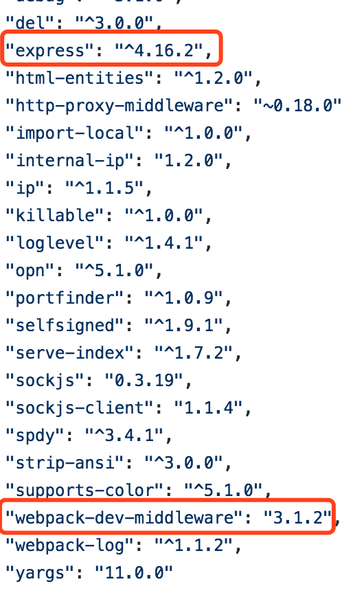

## webpack-dev-middleware原理

#### webpack-dev-middleware是个什么东西
***

使用过webpack的同学应该对这个中间件有所了解。虽然webpack官方给出了webpack-dev-server来替代webpack-dev-middleware的作用。当然在大多数情况下，如果
脚手架的功能比较简单，是可以替代的，而且使用webpack-dev-server实际上更简单，因为不需要涉及node server的开发知识。基本是配置就可以使用了。
不过作为webpack-dev-server的底层依赖中间件，还是有必要对其原理和特性做一个了解的。

#### webpack-dev-server和webpack-dev-middleware的关系
***

我们来看一下webpack-dev-server的package.json，在dependency中可以看到webpack-dev-middleware和express都有被依赖。

而这两个也是webpack-dev-server的核心内容；如果在
webpack-dev-server被开发出来的早期就使用过webpack搭建脚手架的同学，一般的选择组合都是webpack-dev-middleware + express的模式。当然webpack-dev-middleware本身也是必须作为
express-style风格的server的中间件（例如也可以使用connect来开发，实际上，connect是express的底层）。因此如果想要使用koa这类的server，那么是不能直接使用的。当然npm上也有一些对
webpack-dev-middleware该造为koa版本的。

实际上，如果我们只是搭建一个纯静态的网页开发脚手架，使用webpack-dev-server已经可以完成需求了。毕竟webpack-dev-server暴露了足够多的配置接口；但是如果你想拥有更底层的操作能力
更灵活的改造想法，那么了解webpack-dev-middleware就很有必要了。

#### webpack-dev-middleware解析
***

 webpack-dev-middleware的文件结构：

1. reporter.js: 主要完成log的输出，包括颜色美化等；
2. index.js: 入口文件,对外暴露接口；
3. utils.js: 工具类；
4. context.js: 定义作用域，同时挂载webpack的hook;
5. middleware.js: 中间件接入，主要负责接入express服务器;

&ensp;&ensp;&ensp;&ensp;&ensp;&ensp;&ensp;核心文件主要有这五个文件构成。其中每一个文件拥有各自功能的方法。下面就一个一个来分析；
核心文件主要有这五个文件构成。其中每一个文件拥有各自功能的方法。下面就一个一个来分析；
||||

#### 如果要改造webpack-dev-middleware为koa版本该如何做
 可以

